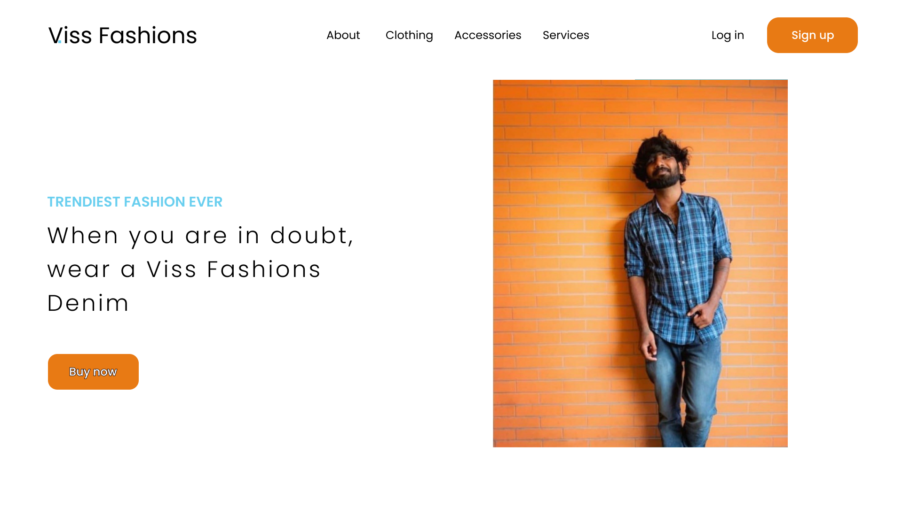

# Viss Fashions Landing Page

Welcome to the Visa Fashions landing page! This is a stylish and responsive website built with HTML and CSS, for Viss Fashions, an online shopping platform. The landing page also contains a signup/login form. Whether you're a fashion enthusiast or a casual shopper, Visa Fashions has something for everyone.



## Features

- **Sleek Design:** Our landing page features a modern and clean design, providing an immersive experience for visitors.
- **Responsive Layout:** The website is designed to look great on devices of all sizes, from desktops to smartphones.
- **Latest Collections:** Explore our curated collections of the latest fashion trends and styles.

## Installation

To view the Visa Fashions landing page locally, simply clone this repository to your machine and open the `index.html` file in your preferred web browser.

```bash
git clone https://github.com/your-username/visa-fashions.git
```

## Usage

Open the `index.html` file in your web browser to explore the Visa Fashions landing page. Click on different sections to discover our latest collections, and don't forget to subscribe to our newsletter for exclusive updates.

## Contributing

We welcome contributions! If you have suggestions for improvements, please open an issue or submit a pull request.

## License

This project is licensed under the [MIT License](LICENSE). Feel free to customize and use the code as per the terms of the license.

## Acknowledgments

Special thanks to the design team for creating an eye-catching and user-friendly landing page.[Design credit](https://www.figma.com/file/5dYwWzODYelQb0agcGEoAU/Learnable-23-Frontend-Technical-Test?type=design&node-id=0%3A1&mode=design&t=t5AO1Vi4vfevlIqV-1)

Visit the live site: [Viss Fashions](https://somilisa.github.io/Viss-Fashions/)
